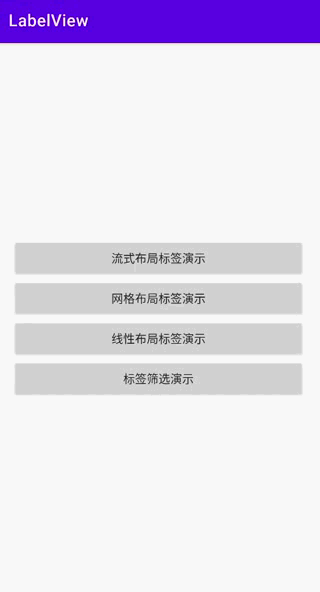
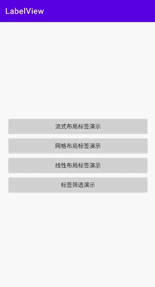

# LabelView

[](https://jitpack.io/#viifo/LabelView)

[中文](https://github.com/viifo/LabelView/blob/master/README.md) | [English](https://github.com/viifo/LabelView/blob/master/README_en.md)

一个标签选中控件。


## 预览

|        流式布局        |        网格布局        |
| :-----------------------: | :-----------------------: |
|  |  |
|      **线性布局**      |     **标签筛选**      |
|  |  |


## 依赖
1.  在根目录下的  `build.gradle` 文件中的 repositories 下添加：
```groovy
allprojects {
    repositories {
        maven { url 'https://jitpack.io' }
    }
}
```
2.  添加依赖
```groovy
dependencies {
    implementation 'com.github.viifo:LabelView:1.0.0'
}
```


## 使用

1.  在 XML 中添加：
```xml
<com.viifo.labelview.LabelLayout
	android:layout_width="match_parent"
	android:layout_height="wrap_content" />
```
2.  标签监听：
```java
// 设置标签数据
val labels = listOf(...)
labelLayout.setLabelList(labels)
// 标签默认选中    
// labelLayout.setLabelList(labels, defultSelectedLabels)

// 设置标签改变事件监听
labelLayout.setOnItemSelectedChangeListener<String> { selected, status ->
    // selected 为当前使用所有选中的标签
    if (status is LabelChangeStatus.ADD) {
        // todo 标签选中
        // status.item 为选中的标签列表
    } else if (status is LabelChangeStatus.REMOVE) {
        // todo 标签取消选中
        // status.item 为取消选中的标签列表
    } else if (status is LabelChangeStatus.INIT) {
        // todo 标签初始化(默认)选中事件
    }
}
```

3.  自定义标签布局：

```xml
<com.viifo.labelview.LabelLayout
	android:layout_width="match_parent"
	android:layout_height="wrap_content"
	app:itemLayout="@layout/label_view_item_with_custom" />
```

```kotlin
labelLayout.setLabelList(
	data = labels, // 标签数据
	selectedData = null, // 默认选中的标签(可选)
	converter = { holder, item, selected ->
    	// todo 自定义标签绑定 view
        // selected - 当前标签是否应该被选中         
	}
)
```


## 属性表

|      name      |  format   |                         description                          |
| :------------: | :-------: | :----------------------------------------------------------: |
|      mode      |   enum    |                         标签布局模式                         |
|  orientation   |   enum    |             标签布局方向（horizontal, vertical）             |
|   itemLayout   | reference |                    自定义标签布局资源文件                    |
|  multiChoice   |  boolean  |                   是否支持多选，默认 false                   |
|  maxSelected   |  integer  |                  最大可选数量，开启多选有效                  |
|   scrollable   |  boolean  | 是否支持滚动，默认 false <br> 流式布局下滚动方向固定垂直<br> 线性布局下滚动方向与布局方向一致 |
|    flexGrow    |  boolean  |              是否填充行剩余空间 ，流式布局有效               |
| justifyContent |   enum    |                  标签对齐方式，流式布局有效                  |
|   spanCount    |  integer  |               每行显示的标签个数，网格布局有效               |


## 标签布局模式（mode）

| name |   description    |
| :--: | :--------------: |
| flex | 流式布局（默认） |
| grid |     网格布局     |
| line |     线性布局     |


## 标签对齐方式（justifyContent）

|     name      |                         description                         |
| :-----------: | :---------------------------------------------------------: |
|  flex_start   |             布局方向起点（左\|上）对齐（默认）              |
|   flex_end    |                 布局方向终点（右\|下）对齐                  |
|    center     |                          居中对齐                           |
| space_between |                          两端对齐                           |
| space_around  | 均匀对齐 (标签两侧间隔一致，两个标签之间的间隔是单侧的两倍) |
| space_evenly  |      均匀对齐（两个标签之间的间隔等于标签单侧的间隔）       |


## License

```
Copyright 2022 viifo

Licensed under the Apache License, Version 2.0 (the "License");
you may not use this file except in compliance with the License.
You may obtain a copy of the License at

   http://www.apache.org/licenses/LICENSE-2.0

Unless required by applicable law or agreed to in writing, software
distributed under the License is distributed on an "AS IS" BASIS,
WITHOUT WARRANTIES OR CONDITIONS OF ANY KIND, either express or implied.
See the License for the specific language governing permissions and
limitations under the License.
```

