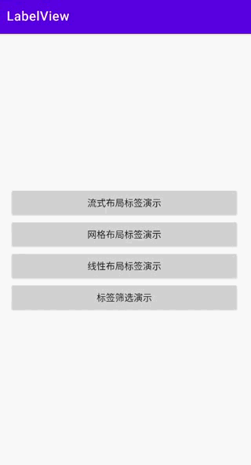
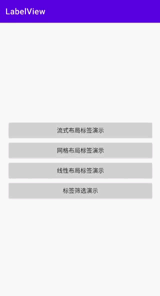

# LabelView

[](https://jitpack.io/#viifo/LabelView)

[中文](https://github.com/viifo/LabelView/blob/master/README.md) | [English](https://github.com/viifo/LabelView/blob/master/README_en.md)

A label selector view for android.


## Preview

|        Flow layout        |        Grid layout        |
| :-----------------------: | :-----------------------: |
|  |  |
|     **Linear layout**     |     **Label filter**      |
|  |  |


## Gradle

1.  Add it in your root `build.gradle` at the end of repositories：

```groovy
allprojects {
    repositories {
        maven { url 'https://jitpack.io' }
    }
}
```

2.  Add the dependency:

```groovy
dependencies {
    implementation 'com.github.viifo:LabelView:1.0.0'
}
```


## Usage

1.  Add in XML:

```xml
<com.viifo.labelview.LabelLayout
	android:layout_width="match_parent"
	android:layout_height="wrap_content" />
```

2.  Label change listener:

```java
// set data
val labels = listOf(...)
labelLayout.setLabelList(labels)
// labels are selected by default
// labelLayout.setLabelList(labels, defultSelectedLabels)

// set label change listener
labelLayout.setOnItemSelectedChangeListener<String> { selected, status ->
    // selected is currently using all selected labels
    if (status is LabelChangeStatus.ADD) {
        // todo label checked
        // status.item is the list of checked labels
    } else if (status is LabelChangeStatus.REMOVE) {
        // todo label unchecked
        // status.item is the list of unchecked labels
    } else if (status is LabelChangeStatus.INIT) {
        // todo 标签初始化(默认)选中事件
    }
}
```

3.  Custom label layout:

```xml
<com.viifo.labelview.LabelLayout
	android:layout_width="match_parent"
	android:layout_height="wrap_content"
	app:itemLayout="@layout/label_view_item_with_custom" />
```

```kotlin
labelLayout.setLabelList(
	data = labels,
	selectedData = null, // optional
	converter = { holder, item, selected ->
    	// todo Custom label binding view
        // selected - Whether the current tab should be selected       
	}
)
```


## Attributes

|      name      |  format   |                         description                          |
| :------------: | :-------: | :----------------------------------------------------------: |
|      mode      |   enum    |                      Label layout mode                       |
|  orientation   |   enum    |        Label layout direction（horizontal, vertical）        |
|   itemLayout   | reference |                 Custom Label Layout Resource                 |
|  multiChoice   |  boolean  |     Whether to support multiple selection, default false     |
|  maxSelected   |  integer  | The maximum number of options available, valid for multiple selection |
|   scrollable   |  boolean  | Whether to support scrolling, the default is false <br/> The scrolling direction is fixed vertically under the fluid layout<br/> The scrolling direction is the same as the layout direction under the linear layout |
|    flexGrow    |  boolean  | Whether to fill the remaining space of the row, the flow layout is valid |
| justifyContent |   enum    |             Label alignment, fluid layout works              |
|   spanCount    |  integer  | The number of labels displayed per row, the grid layout is valid |


## Label mode style

| name |      description      |
| :--: | :-------------------: |
| flex | Flex layout (default) |
| grid |      Grid layout      |
| line |     Linear layout     |


## Label justifyContent style

|     name      |                         description                          |
| :-----------: | :----------------------------------------------------------: |
|  flex_start   |      Labels are packed toward the start line. (default)      |
|   flex_end    |            Labels are packed toward the end line.            |
|    center     | Labels are centered along the flex line where the flex items belong. |
| space_between | Labels are evenly distributed along the flex line, first flex item is on the start line, the last flex item is on the end line. |
| space_around  | Labels are evenly distributed along the flex line with the same amount of spaces between the flex lines. |
| space_evenly  | Labels are evenly distributed along the flex line. The difference between SPACE_AROUND is that all the spaces between items should be the same as the space before the first item and after the last item. |


## License

```
Copyright 2022 viifo

Licensed under the Apache License, Version 2.0 (the "License");
you may not use this file except in compliance with the License.
You may obtain a copy of the License at

   http://www.apache.org/licenses/LICENSE-2.0

Unless required by applicable law or agreed to in writing, software
distributed under the License is distributed on an "AS IS" BASIS,
WITHOUT WARRANTIES OR CONDITIONS OF ANY KIND, either express or implied.
See the License for the specific language governing permissions and
limitations under the License.
```

